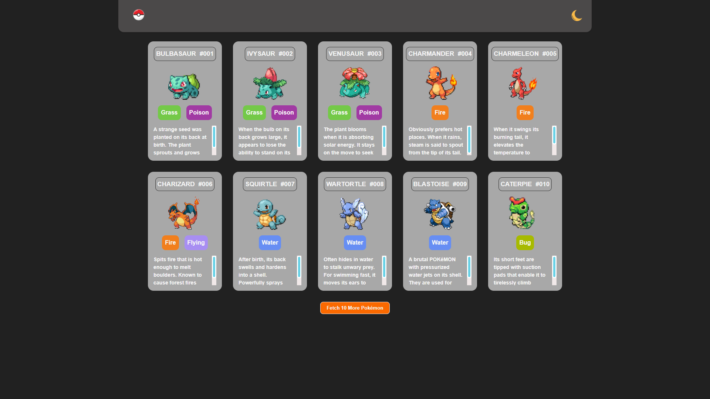
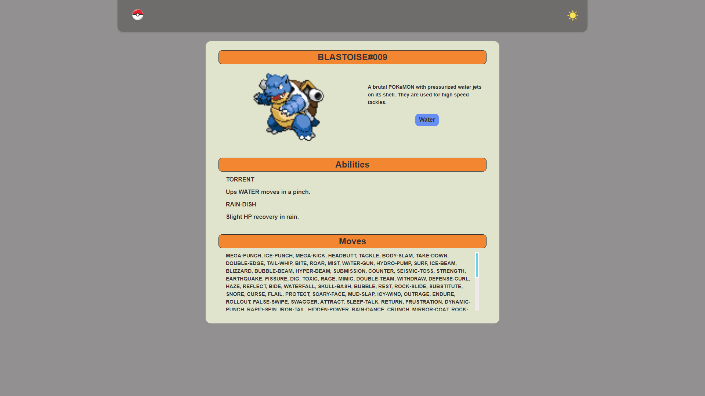

# Pokédex React Version
## (Last Update) - 29/01/2024
### This project is a milestone of a FullStack developer course, the final challenge for Frontend, serving to reinforce foundational principles and then upload it to a GitHub repository.

## Table of contents

- [Overview](#overview)
  - [The challenge](#the-challenge)
  - [Layout](#-layout)
  - [Links](#links)
- [My process](#my-process)
  - [Technologies](#-technologies)
  - [What I learned](#what-i-learned)
  - [Suggested Enhancements](#-suggested-enhancements)
- [Author](#author)

## Overview

### The challenge

- [x] Create a Home page with 10 pokemon and the possibility of fetching more with a button.
- [x] A second page with more information for each pokemon, showing their abilities and possible moves.
- [x] Single Page Application (SPA);
- [x] Context API acting as Theme Toggler;
- [x] Styled-components;
- [x] React-router-dom;

:thought_balloon: Note worthy observation:

- This project is very similar to the first contact I had with DevEmDobro, I believe this was the ideia, to create a site using everything we have learned and make a better version from the first atempt, that is why I have chosen to make a layout as close as possible to the first one, keeping the experience as close as possible and highlighting the key differences from HTML/CSS/JS to React.


### 🔖 Layout

<div align="center">
    <p>Dark Theme Home Layout:</p>
    
</div>

<div align="center">
    <p>Light Theme Detailed Page Layout:</p>
    
</div>

### Links

- Solution URL: [GitHub Repo](https://github.com/bigodrigo/PokedexReactProject)
- Live Site URL: [GitHub Page](https://bigodrigo.github.io/PokedexReactProject)

## My process

### 🚀 Technologies

- React
- [PropTypes](https://legacy.reactjs.org/docs/typechecking-with-proptypes.html)
- [Styled-Components](https://styled-components.com)
- [ContextAPI](https://legacy.reactjs.org/docs/context.html)
- [React Router Dom](https://v5.reactrouter.com/web/guides/quick-start)

### What I learned

- Working with Styled-Components was a harder task then I had anticipated, I'm more used to work with tailwind, sass or plain css, so some of the ideias I had needed some work-arounds;
- I had worked with Context before, but when linking it with the Styled-Components and a Theme I needed to rethink the structure I had already done and that was an interesting removal of my confort-zone;
- The React Router was also something interesting, not much of a challenge but the routes are still something new to me;
- One of the hardest parts was that there was 3 different fetches to be done and adding all of that into one Object, specially the abilities that don't have their description on every pokemon and needed another url.
- Some text manipulation was also needed, first we had special characters like "\n" that needed to be removed, but also the abilities object comes with different languages, to keep the info in english I had to search for one prop(language: "en") and return the correct text.

```js
// Using localStorage to keep the theme on a second visit or from detail page to home
    const storedTheme = localStorage.getItem('theme');
    const initialTheme = storedTheme ? JSON.parse(storedTheme) : themes.light;

    const [theme, setTheme] = useState(initialTheme);

    const toggleTheme = () => {
        setTheme(prevTheme => (prevTheme.light ? themes.dark : themes.light));
    };

    useEffect(() => {
        localStorage.setItem('theme', JSON.stringify(theme));
    }, [theme]);
```

```js
// Passing info as props inside Styled-Components
    const Body = styled.div`
        font-family: 'Poppins', sans-serif;
        min-height: 100vh;
        background-color: ${props => props.theme.backgroundColor};
        color: ${props => props.theme.color};
        font-weight: bold;
    `;
```

```js
// Text manipulation codes
    export function getEnglishFlavorText(flavorTextEntries) {
        for (const entry of flavorTextEntries) {
            if (entry.language.name === 'en') {
                return entry.flavor_text;
            }
        }
        return '';
    }

    export function removeBarra(value) {
        const stringValue = value.toString();
        const replacedValue = stringValue.replaceAll('\n', ' ').replaceAll('\f', ' ');
        return replacedValue;
    }
```

### :muscle: Suggested Enhancements:

- [ ] Add a skeleton Animation for the Fetch;
- [ ] Keep the information on the context or localStorage;
- [ ] Create an extra page or section for every region;
- [ ] Refactoring some of the styles for the types colors and scrollbar;
- [ ] Working with Classes, Objects.

## Author

- Portfolio - [Rodrigo](https://portfolio-bigodrigo.vercel.app/)
- GitHub - [bigodrigo](https://github.com/bigodrigo)
- Linkedin - [rodrigo-boquer](https://www.linkedin.com/in/rodrigo-boquer/)
